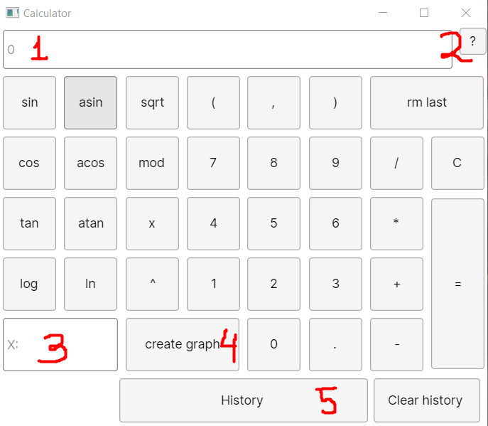
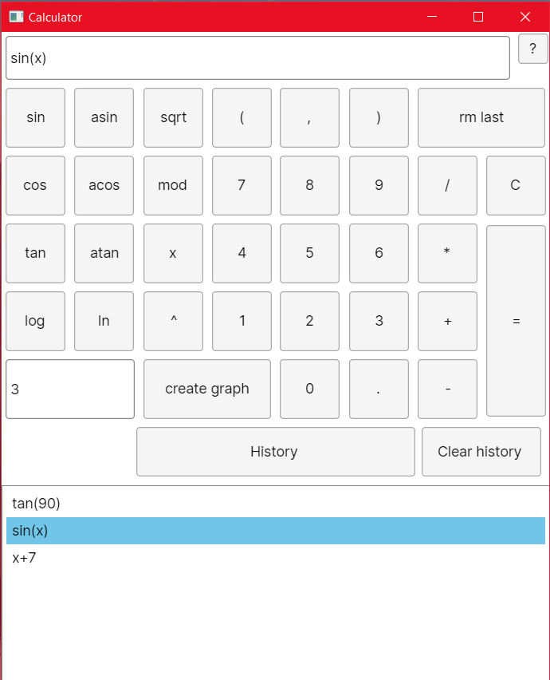
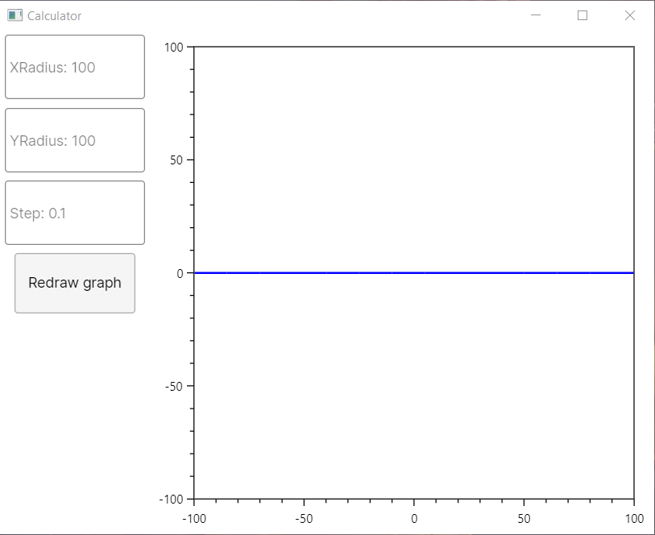
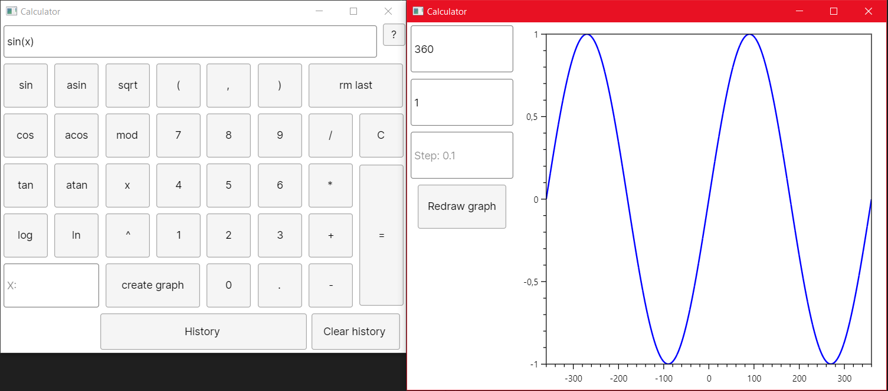

# SmartCalc

Расширенная версия обычного калькулятора, написанная на языке C# с использованием кроссплатформенной платформы Avalonia. 
"Ядро" калькулятора для вычислений польской нотации подключается в виде самописной динамической библиотеки написанной на C/C++.

 

1. поле для ввода уравнения(поддерживает ввод с клавиатуры), также позволяет вводить переменную Х
2. открывает документацию в виде html страницы
3. поле для ввода переменной Х
4. открывает новое окно для построения графиков
5. расширяет текущее окно для выбора предыдущих вычислений

 

+ Скриншот после нажатия на кнопку History.
+ Повторное нажатие скроет список операций.
+ Кнопка Clear History очищает историю.
+ История сохраняется между перезапусками программы.

 

+ Нажатие на кнопку create graph откроет новое окно.
+ Поле ввода XRadius определяет минимальную и максимальную область определения.
+ Поле ввода YRadius определяет минимальную и максимальную область значения.
+ Поле ввода Step определяет шаг оси X.
+ Нажатие на кноку Redraw graph обновит график.
+ Уравнение вводится в главном окне.

 

